## Reproducible Research Principles: : January 18, 2017

[Presentation from Vicki Hertzberg](http://htmlpreview.github.com/?https://raw.githubusercontent.com/vhertzb/N741/master/Reproducible%20Research.html)

To get us started on the path to learning and using reproducible research principles, this week we will focus on:

1. Setting up RStudio with Git connected to Github enabling version control (tracking the code, analysis and documentation process)
2. Writing your 1st Rmarkdown file combining R code and documentation to create a data analysis report.

## Using Version Control

### Link RStudio to Github using Git

1. Login to your Github account.
2. Click on Repositories or Click New Repository
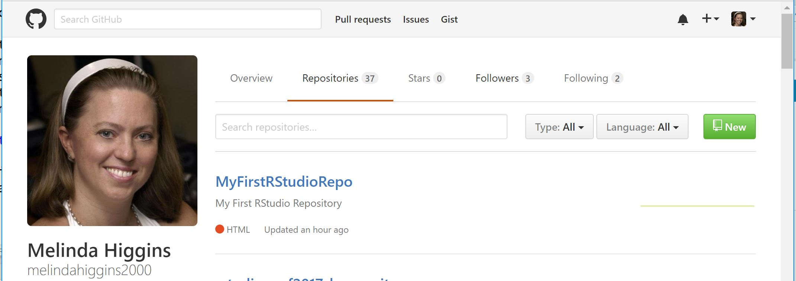

3. Create a new repository "n741repo1", type in a description, and initialize with a README file. Click "Create Repository"
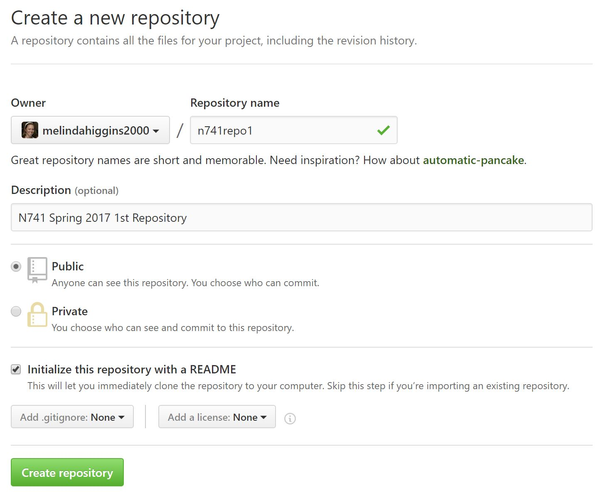. LEAVE YOUR BROWSER OPEN at your Github repository website.

4. Start RStudio. Click File/New Project. Choose "Version Control"

5. Choose Git
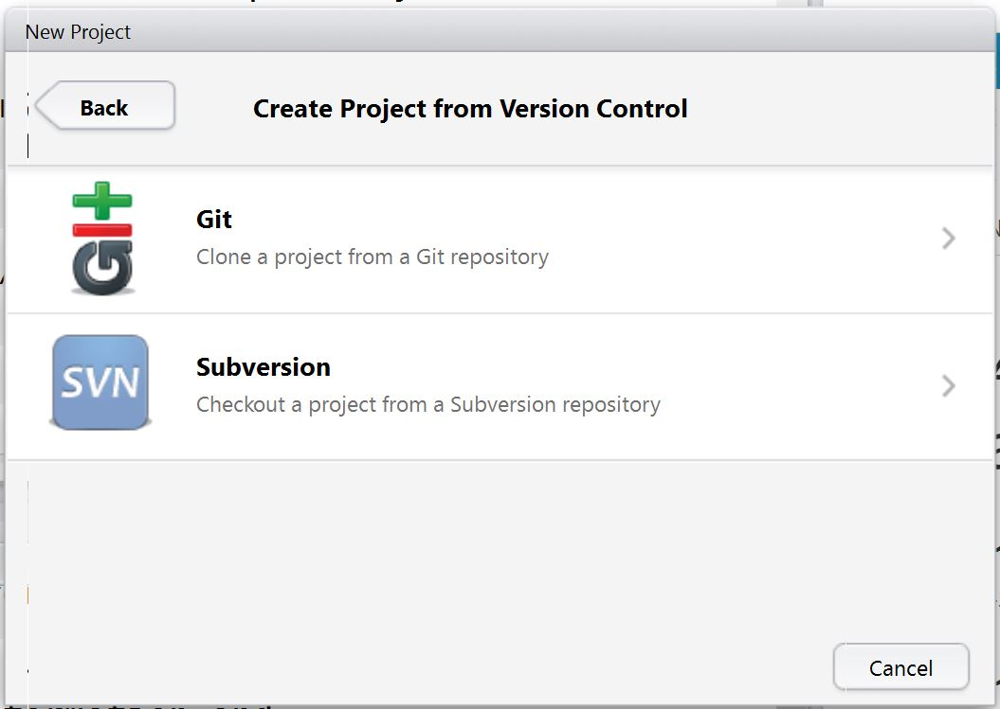

6. To get the URL for the Github repo - go back to your browser, click on the GREEN button "Clone or Download". Right below the button it will open another window. For this example we will "Clone with HTTPS". Click the little box with the arrow in it just to the right of the URL to "Copy the URL to the clipboard".
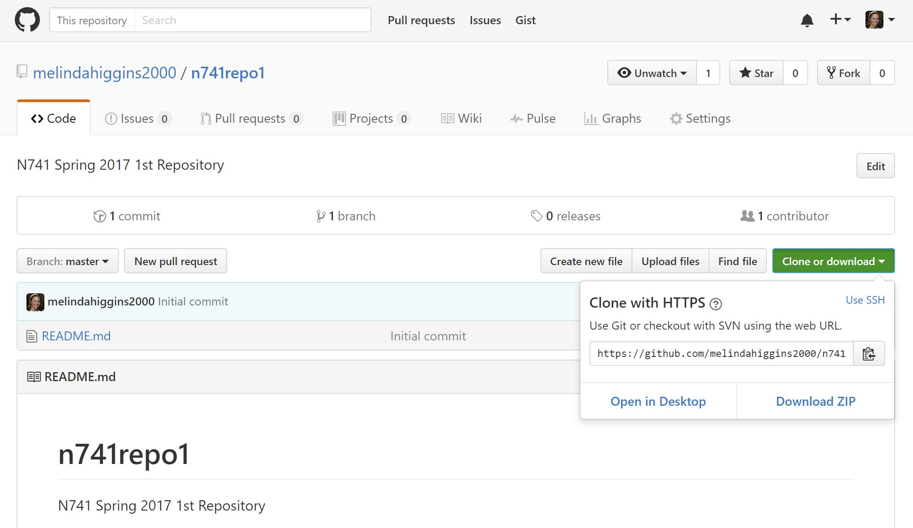

7. Now we will "paste" this URL into the RStudio window to complete our project set-up connecting RStudio to Github via Git in your new R project. "Paste" in the URL in the top box for "Repository URL". This will autopopulate the "Project directory Name" - USE THIS NAME. In the bottom box, make sure you select the directory where you want this new project directory to be placed (e.g. C:/MyRFiles) or a location you are using to manage all of your files for this course.
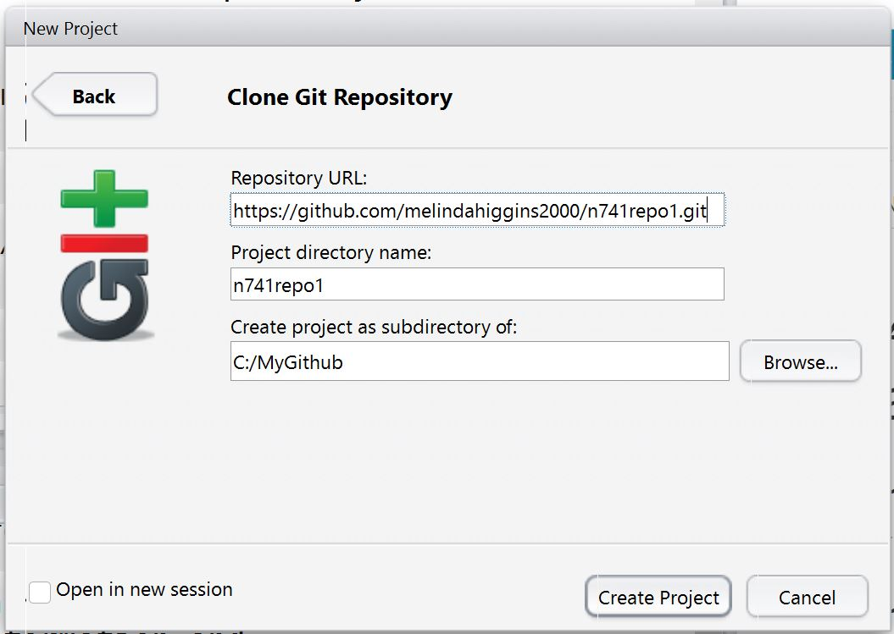

### New R Project Files

8. In RStudio, your project will now have 3 files in it (bottom right panel of screenshot below):

* README.md - this is the README file in your Github repo
* n741repo1.Rproj - this is the R project configuration file for your project settings in RStudio
* .gitignore - this is a listing for Git to ignore.

If everything worked correctly, you'll now see the word Git in a little vertical box at the top of the screen, right under the "Tools" menu. You will also notice in the top right window, 3 tabs "Environment", "History", and "Git".
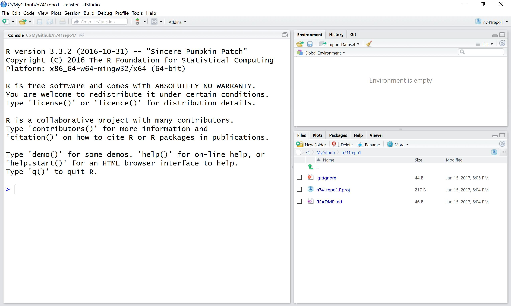

9. Click on the "Git" tab. You'll notice that there are little yellow ? question marks which indicates that `n741repo1.Rproj` and `.gitignore` are as yet untracked. This is because these files were created by RStudio locally and these have not been added (a) to the Github repository and (b) have not yet been "brought under version control".

### Stage and Commit New Files

10. To add these files to our Github repository and "bring them under version control", click on "Commit". This will open another window. In this new window, click on the check boxes to the left of the file names in the top left window under "Staged". As soon as you click on these boxes, the little yellow ?s will turn to green As indicating that these files have been "added" to this "commit." 

BEFORE you click the "Commit" button, type in a description of what was changed or added in this "commit" - something like "added new r project files". After typing in your description, click the "Commit" button. After cliking "Commit" you should see a confirmation message.

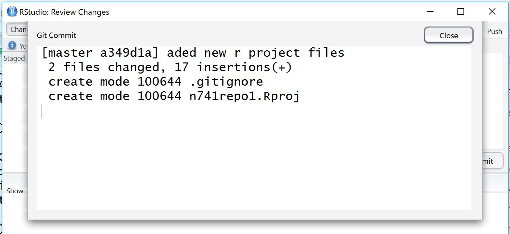

### PUSH Files to Github Repository

11. "Commit" is the 1st step. The files are NOT YET added to the repository - they are NOT YET under version control. To do so, we need to PUSH the files we've committed up to Github. To PUSH the files up to Github, click on the GREEN UP ARROW and see the message generated.

12. Go to Github and see that the files have been added to your repository. 
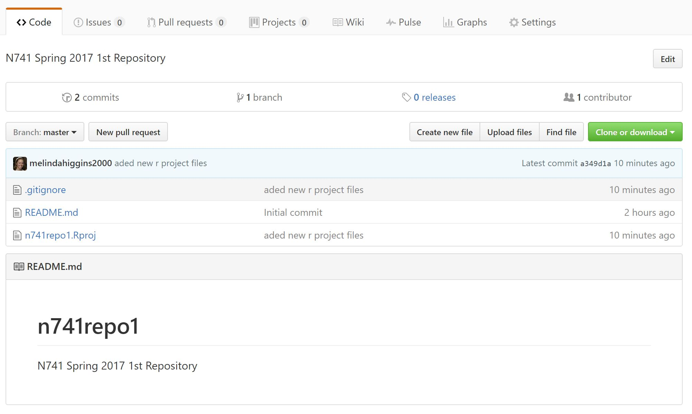

You'll notice at the top left there is a clock symbol that now says "2 commits". Click on this symbol. This shows the 1st "commit" when we created the repo with the readme and the 2nd "commit" was the files we just added after creating the R project. Using this view, you can click on each "commit" and review every version, every change that occured from the time the repo was created. _"Voilà"_ you never have to create long file names with odd naming schemes to keep track of which version of the file(s) as you make changes and updates.
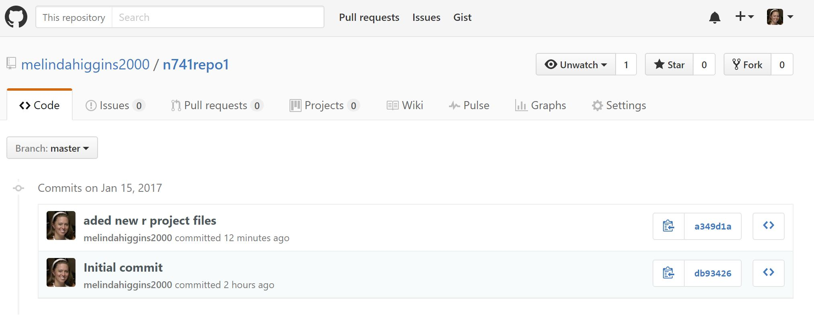

13. Let's make some changes to the README.md file - open the README file and add some new text and save the file. You'll notice in the Git TAB (top right), the README file now shows with a BLUE M indicating that the file has been modified.

Next "commit" those changes - click the box under "staged and then click "commit" and type in a message for this "commit". In this window we can easily see what the differences are in the bottom panel. The text in GREEN is the new text we added.

14. NEXT, PUSH the new README.md file up to the Github repo. Then go to the Github repo website and refresh - you should now see your changes to the README file.

### Make Changes Online Using Github

15. Let's see what happens if we make changes in the Github repo and then PULL those changes down to your R Project folder. In your Github repo, click on the link for the README.md file. This opens the file into a window where you can view the "Raw" file, see who to "Blame" for various edits and commits and review the "History" of the file. If you click on the pencil icon, you'll be able to edit the README file and save your changes using the browser editor. Remember to add a commit message and then click the GREEN button "Commit Changes".

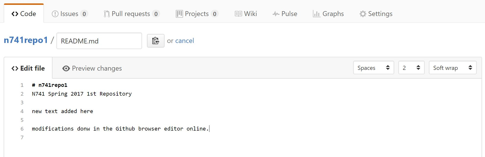
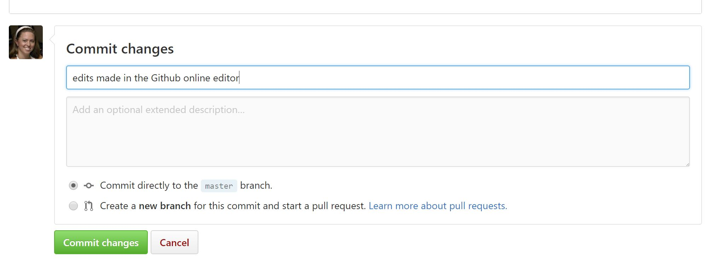

16. Check your Github repo - you'll see your new changes.

### PULL Updates from Github Down to RStudio

17. Now let's go update our R project with these new changes. This time we PULL the changes from Github down to our local R project.

The resulting Git PULL message should confirm the updates. You'll then see the changes to your README file in your RStudio project.

18. **Congratulations** you have now successfully:

* established a Github repo
* enabled version control and tracking using Git
* created an R project linked to your Github repo
* and brought all of your files under version control and tracking with full backup.

## RMarkdown Example with Gapminder

[Github Repo for N741 Gapminder Example](https://github.com/melindahiggins2000/N741gapminder1)

[Worked Example in HTML](http://htmlpreview.github.com/?https://raw.githubusercontent.com/melindahiggins2000/N741gapminder1/master/GapminderMarkdown.html)

